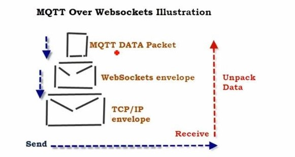

## Pomelo 依赖三方的库

### seq-queue
seq-queue 队列执行请求的库  

##### 参考
[seq-queue - queue to keep request process in sequence](https://www.npmjs.com/package/seq-queue)

### crc
crc 生成库（crc没看懂）

##### 参考
[crc](https://www.npmjs.com/package/crc)

### cliff
格式化输出辅助库

##### 参考
[cliff](https://www.npmjs.com/package/cliff)

### mkdirp
类似于 `mkdir -p`
> -p, --parents 可以是一个路径名称。此时若路径中的某些目录尚不存在,加上此选项后,系统将自动建立好那些尚不存在的目录,即一次可以建立多个目录;

##### 参考
[mkdirp](https://www.npmjs.com/package/mkdirp)

### node-bignumber
???

##### 参考
[node-bignumber](https://www.npmjs.com/package/node-bignumber)

### Commander
???

##### 参考
[Commander.js](https://www.npmjs.com/package/commander)]

### mqtt
js版本的mqtt协议实现

##### 参考
[mqtt](https://www.npmjs.com/package/mqtt)

### Pomelo 依赖自家的库

### pomelo-loader
加载文件并映射到map

### pomelo-logger
扩展了log4js:
1. 重定义configure，支持已文件形式配置logger,支持${}的变量模板
2. 重定义getLogger，可以任意追加前缀
3. 扩展配置项reloadSecs,可以再文件中加入该选项，会在相应时间刷新配置。

#### 参考
[Colors In Terminal](http://jafrog.com/2013/11/23/colors-in-terminal.html)

### pomelo-rpc

#### 参考
1. [MQTT vs HTTP | Difference between MQTT and HTTP protocols](http://www.rfwireless-world.com/Terminology/MQTT-vs-HTTP.html)

2. 

3. [mqtt-connection](https://www.npmjs.com/package/mqtt-connection)

